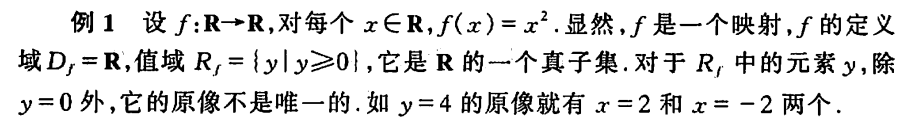

# 直接用同济教材

## “互质”是什么东西？

**互质是**公约数只有1的两个整数，叫做**互质**整数。

### “公约数“是什么东西？

common divisor

**也称公因数，common factor**

例如8和12的最大公因数为4。

### 结论

如果两个数只能同时被1整除，那它们“互质”。

## 中文书简直是垃圾

`F` is not a '映射'，it's a `function` .

## Math Symbols

{% embed url="https://zh.wikipedia.org/wiki/%E6%95%B0%E5%AD%A6%E7%AC%A6%E5%8F%B7%E8%A1%A8" %}

## 补集

{% embed url="https://zh.wikipedia.org/wiki/%E8%A1%A5%E9%9B%86" %}

